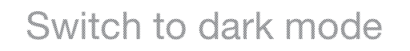

# Discord Image Mixer
This program combines two images into one such that when viewed in the Discord client, one image is visible while using light mode, and the other is visible while using dark mode. This of course means that each image will end up only being visible in a single color.

### Usage
Prepare two images to combine. Note that the program only uses the opacity of the pixels in the images, and ignores the color. Also note that they must have the same dimensions. Once you have the images, run the program. It will prompt for 3 paths: those of the dark mode image and light mode image, and the path to save to. The dark mode image is the one that will be pictured in light pixels and will be visible in dark mode, and vice versa. Once you've enttered the paths, as long as the image sizes match, a new image of the same size will be generated at the path you specified.

#### Example Image

This image will display "Switch to dark mode" when viewed in light mode, and will display "Switch to light mode" when viewed in dark mode.
